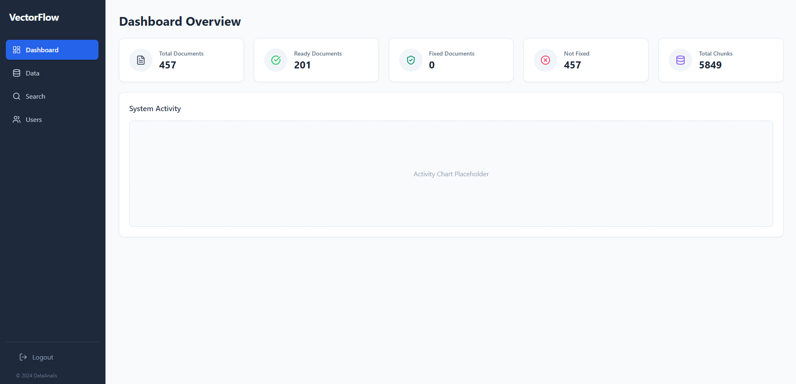
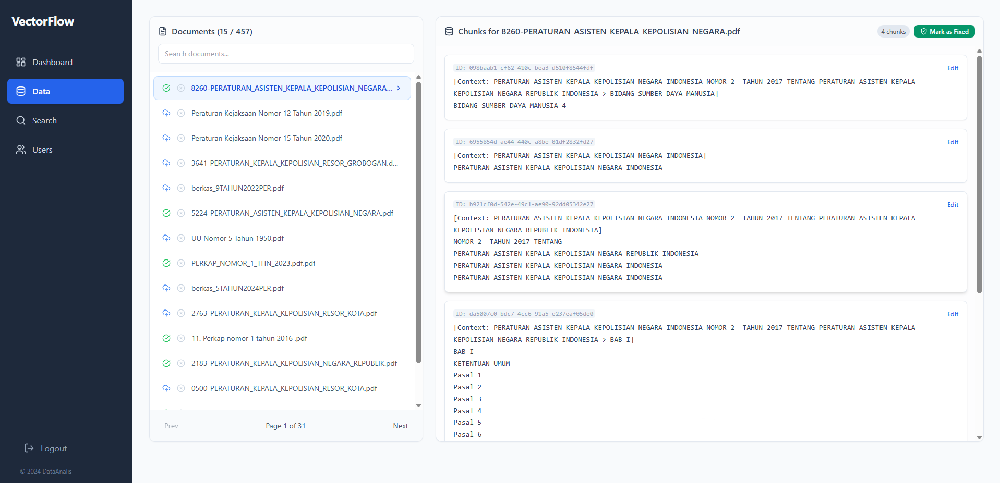
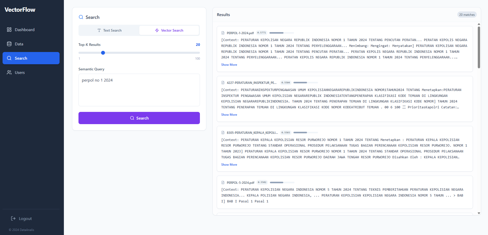

# VectorFlow Manager 🚀

**VectorFlow Manager** is a specialized administrative platform designed to streamline the management of high-dimensional vector data within **Qdrant**. It serves as a critical bridge in the **RAG (Retrieval-Augmented Generation)** pipeline, allowing developers and data curators to refine the quality of text chunks to ensure AI models receive the most accurate context.

---

## 📝 Overview

In modern AI applications, the quality of retrieved context is everything. **VectorFlow Manager** provides a GUI-based workflow to manage the lifecycle of your embeddings. Instead of running manual scripts to fix data, you can browse, edit, and test your vector search results in real-time.

## 🛡️ Core Features

* **Qdrant Data Retrieval**: Seamlessly connect to Qdrant clusters to fetch points and payloads via IDs or advanced metadata filtering.
* **Live Chunk Editor**: A robust CRUD interface to modify raw text content. Fix parsing errors or update outdated information without re-indexing the entire database.
* **Semantic Search Simulator**: Built-in testing suite to run similarity search queries. Visualize **Top-K** results and analyze similarity scores (Cosine, $L2$, or Dot Product).
* **Metadata Orchestration**: Manage complex payload structures and tags to optimize filtered retrieval strategies.

## 🚀 Key Workflows

1.  **Ingestion & Inspection**: Connect to your Qdrant cluster and browse collections to see how your data is structured.
2.  **Refinement**: Use the editor to clean up noise from OCR/PDF extraction or to refine text for better LLM comprehension.
3.  **Vector Syncing**: Automatically trigger re-embedding when text is updated to keep the vector representation in sync.
4.  **Simulation**: Run user-like queries to validate that the modified chunks appear in the search results as expected.

## 🛠️ Tech Stack

- **Backend**: Node.js (Express)
- **Frontend**: React.js 
- **Database**: [Qdrant Vector Database](https://qdrant.tech/)
- **Integration**: 'BAAI/bge-m3'

## 🎯 Use Cases

- **RAG Precision Tuning**: Manually adjusting "Golden Chunks" for mission-critical chatbots.
- **Data Sanitization**: Removing PII or irrelevant noise from vector stores.
- **Search Optimization**: Testing how different text formatting affects retrieval ranking.

---

## 🏁 Screshots

